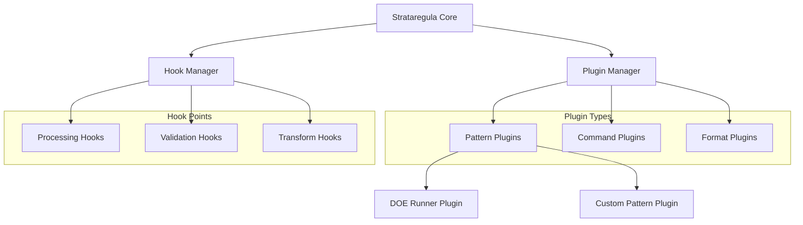
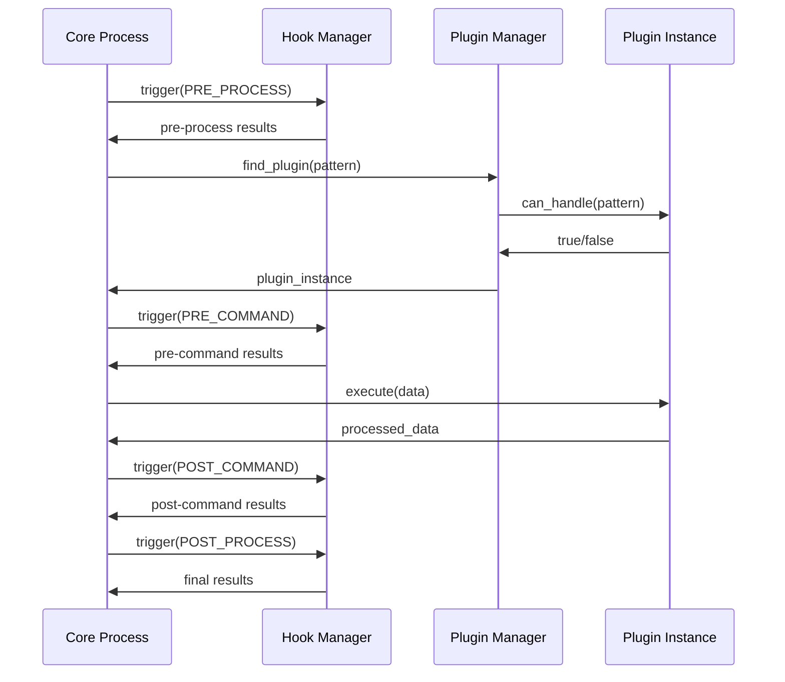

# Plugin System & Hook System Design Document

## 🎯 Executive Summary

This document outlines the comprehensive design for Strataregula's Plugin and Hook systems, analyzing current implementation and proposing improvements for v0.2.0.

## 📋 Current Implementation Analysis

### Plugin System (strataregula/plugins/)

**✅ What exists:**
```python
# Simple, focused design
class PatternPlugin(ABC):
    @property
    @abstractmethod
    def info(self) -> PluginInfo:
        pass
    
    @abstractmethod
    def can_handle(self, pattern: str) -> bool:
        pass
    
    @abstractmethod
    def expand(self, pattern: str, context: Dict[str, Any]) -> Dict[str, Any]:
        pass

class PluginManager:
    def register_plugin(self, plugin: PatternPlugin) -> None
    def expand_pattern(self, pattern: str, context: Dict[str, Any]) -> Dict[str, Any]
```

**❌ Missing:**
- Plugin discovery/loading
- Plugin lifecycle management
- Error handling and fallbacks
- Configuration system
- Documentation and examples

### Hook System (strataregula/hooks/)

**✅ What exists:**
```python
# Comprehensive, async-ready design
class HookType(Enum):
    PRE_PROCESS = "pre_process"
    POST_PROCESS = "post_process"
    PRE_COMMAND = "pre_command"
    POST_COMMAND = "post_command"
    # ... more hook types

class HookCallback:
    name: str
    callback: Callable
    hook_type: HookType
    priority: int = 0
    async_support: bool = False
    
    async def execute(self, *args, **kwargs) -> Any

class HookRegistry:
    def register(self, hook_type: HookType, callback: Callable) -> str
    def trigger(self, hook_type: HookType, *args, **kwargs) -> List[Any]
```

**❌ Missing:**
- Integration with core processing flow
- Hook point documentation
- Context passing patterns
- Error handling strategies

## 🏗️ Architectural Design

### Overview Architecture



### Component Interaction Flow



## 🎨 Plugin System Design

### 1. Plugin Types and Hierarchy

```python
# Base plugin interface
class BasePlugin(ABC):
    @property
    @abstractmethod
    def info(self) -> PluginInfo:
        """Plugin metadata"""
        pass
    
    @abstractmethod
    def initialize(self, config: Dict[str, Any]) -> None:
        """Plugin initialization"""
        pass
    
    @abstractmethod
    def cleanup(self) -> None:
        """Plugin cleanup"""
        pass

# Specialized plugin types
class PatternPlugin(BasePlugin):
    """Handles pattern expansion"""
    @abstractmethod
    def can_handle(self, pattern: str) -> bool: pass
    @abstractmethod
    def expand(self, pattern: str, context: Dict[str, Any]) -> Dict[str, Any]: pass

class CommandPlugin(BasePlugin):
    """Provides new commands for PiPE"""
    @abstractmethod
    def get_commands(self) -> List[BaseCommand]: pass

class FormatPlugin(BasePlugin):
    """Handles input/output formats"""
    @abstractmethod
    def can_read(self, format: str) -> bool: pass
    @abstractmethod
    def can_write(self, format: str) -> bool: pass
    @abstractmethod
    def read(self, data: str, format: str) -> Any: pass
    @abstractmethod
    def write(self, data: Any, format: str) -> str: pass

class HookPlugin(BasePlugin):
    """Registers custom hooks"""
    @abstractmethod
    def register_hooks(self, hook_manager: HookManager) -> None: pass
```

### 2. Plugin Discovery and Loading

```python
class PluginLoader:
    """Discovers and loads plugins"""
    
    def discover_plugins(self) -> List[PluginInfo]:
        """Discover plugins from multiple sources"""
        plugins = []
        
        # 1. Entry points (pip installed packages)
        plugins.extend(self._discover_entry_points())
        
        # 2. Local plugin directory
        plugins.extend(self._discover_local_plugins())
        
        # 3. Configuration-specified plugins
        plugins.extend(self._discover_config_plugins())
        
        return plugins
    
    def load_plugin(self, plugin_info: PluginInfo) -> BasePlugin:
        """Load a specific plugin"""
        try:
            module = importlib.import_module(plugin_info.module)
            plugin_class = getattr(module, plugin_info.class_name)
            return plugin_class()
        except Exception as e:
            logger.error(f"Failed to load plugin {plugin_info.name}: {e}")
            raise PluginLoadError(f"Cannot load {plugin_info.name}")

# Entry points discovery (setup.py/pyproject.toml)
[project.entry-points."strataregula.plugins"]
"doe_runner" = "strataregula_doe_runner.plugin:DOERunnerPlugin"
"custom_patterns" = "my_package.plugins:CustomPatternPlugin"
```

### 3. Plugin Manager Enhanced

```python
class PluginManager:
    """Enhanced plugin management"""
    
    def __init__(self, config: Optional[Dict] = None):
        self.config = config or {}
        self.loader = PluginLoader()
        self.plugins: Dict[str, BasePlugin] = {}
        self.pattern_plugins: List[PatternPlugin] = []
        self.command_plugins: List[CommandPlugin] = []
        self.format_plugins: List[FormatPlugin] = []
        self.hook_plugins: List[HookPlugin] = []
        
    def load_all_plugins(self) -> None:
        """Load all discoverable plugins"""
        discovered = self.loader.discover_plugins()
        
        for plugin_info in discovered:
            if self._should_load(plugin_info):
                try:
                    plugin = self.loader.load_plugin(plugin_info)
                    self.register_plugin(plugin)
                except PluginLoadError as e:
                    logger.warning(f"Skipping plugin: {e}")
                    
    def register_plugin(self, plugin: BasePlugin) -> None:
        """Register a plugin with type-specific handling"""
        plugin.initialize(self.config.get(plugin.info.name, {}))
        
        self.plugins[plugin.info.name] = plugin
        
        # Type-specific registration
        if isinstance(plugin, PatternPlugin):
            self.pattern_plugins.append(plugin)
        elif isinstance(plugin, CommandPlugin):
            self.command_plugins.append(plugin)
        elif isinstance(plugin, FormatPlugin):
            self.format_plugins.append(plugin)
        elif isinstance(plugin, HookPlugin):
            self.hook_plugins.append(plugin)
            
        logger.info(f"Registered {type(plugin).__name__}: {plugin.info.name}")
    
    def get_plugin_for_pattern(self, pattern: str) -> Optional[PatternPlugin]:
        """Find best plugin for pattern (prioritized)"""
        candidates = [p for p in self.pattern_plugins if p.can_handle(pattern)]
        
        if not candidates:
            return None
            
        # Return highest priority plugin
        return max(candidates, key=lambda p: p.info.priority)
```

## 🔗 Hook System Design

### 1. Hook Points and Context

```python
class HookContext:
    """Context object passed to hooks"""
    def __init__(self, operation: str, data: Any = None, **kwargs):
        self.operation = operation
        self.data = data
        self.metadata = kwargs
        self.results: Dict[str, Any] = {}
        
    def set_result(self, key: str, value: Any) -> None:
        self.results[key] = value
        
    def get_result(self, key: str, default: Any = None) -> Any:
        return self.results.get(key, default)

class HookPoint(Enum):
    """All available hook points in the system"""
    
    # Core Processing
    CORE_INIT = "core.init"
    CORE_SHUTDOWN = "core.shutdown"
    
    # Pattern Processing
    PATTERN_PRE_EXPAND = "pattern.pre_expand"
    PATTERN_POST_EXPAND = "pattern.post_expand"
    PATTERN_VALIDATE = "pattern.validate"
    
    # Command Processing  
    COMMAND_PRE_EXECUTE = "command.pre_execute"
    COMMAND_POST_EXECUTE = "command.post_execute"
    COMMAND_ERROR = "command.error"
    
    # Pipeline Processing
    PIPELINE_START = "pipeline.start"
    PIPELINE_STEP = "pipeline.step"
    PIPELINE_COMPLETE = "pipeline.complete"
    PIPELINE_ERROR = "pipeline.error"
    
    # Data Processing
    DATA_PRE_LOAD = "data.pre_load"
    DATA_POST_LOAD = "data.post_load"
    DATA_PRE_SAVE = "data.pre_save"
    DATA_POST_SAVE = "data.post_save"
    DATA_VALIDATE = "data.validate"
    DATA_TRANSFORM = "data.transform"
    
    # Plugin Lifecycle
    PLUGIN_LOADED = "plugin.loaded"
    PLUGIN_ACTIVATED = "plugin.activated"
    PLUGIN_DEACTIVATED = "plugin.deactivated"
    PLUGIN_ERROR = "plugin.error"
```

### 2. Hook Manager Enhanced

```python
class HookManager:
    """Enhanced hook management system"""
    
    def __init__(self):
        self.registry = HookRegistry()
        self.context_factory = lambda **kwargs: HookContext(**kwargs)
        self.error_handlers: Dict[HookPoint, List[Callable]] = {}
        
    def register(self, hook_point: HookPoint, callback: Callable,
                name: Optional[str] = None, priority: int = 0) -> str:
        """Register a hook callback"""
        return self.registry.register(
            hook_point, callback, name, priority
        )
    
    def register_decorator(self, hook_point: HookPoint, priority: int = 0):
        """Decorator for registering hooks"""
        def decorator(func):
            self.register(hook_point, func, func.__name__, priority)
            return func
        return decorator
    
    async def trigger(self, hook_point: HookPoint, context: HookContext) -> HookContext:
        """Trigger all hooks for a specific point"""
        callbacks = self.registry.get_callbacks(hook_point)
        
        for callback_info in sorted(callbacks, key=lambda x: x.priority, reverse=True):
            try:
                result = await callback_info.execute(context)
                if result is not None:
                    context.set_result(callback_info.name, result)
            except Exception as e:
                logger.error(f"Hook {callback_info.name} failed: {e}")
                await self._handle_hook_error(hook_point, callback_info, e, context)
                
        return context
    
    async def _handle_hook_error(self, hook_point: HookPoint, 
                                callback_info: HookCallback, 
                                error: Exception, 
                                context: HookContext) -> None:
        """Handle errors from hook execution"""
        error_handlers = self.error_handlers.get(hook_point, [])
        for handler in error_handlers:
            try:
                await handler(callback_info, error, context)
            except Exception as handler_error:
                logger.critical(f"Error handler failed: {handler_error}")
```

### 3. Integration with Core Processing

```python
class ProcessingEngine:
    """Core processing engine with integrated hooks"""
    
    def __init__(self, plugin_manager: PluginManager, hook_manager: HookManager):
        self.plugins = plugin_manager
        self.hooks = hook_manager
        
    async def expand_pattern(self, pattern: str, context: Dict[str, Any]) -> Dict[str, Any]:
        """Pattern expansion with full hook integration"""
        
        # Create hook context
        hook_context = HookContext(
            operation="pattern_expand",
            pattern=pattern,
            context=context
        )
        
        # Pre-expansion hooks
        hook_context = await self.hooks.trigger(
            HookPoint.PATTERN_PRE_EXPAND, hook_context
        )
        
        # Pattern validation hooks
        hook_context = await self.hooks.trigger(
            HookPoint.PATTERN_VALIDATE, hook_context
        )
        
        # Find and execute plugin
        plugin = self.plugins.get_plugin_for_pattern(pattern)
        if plugin:
            try:
                result = plugin.expand(pattern, context)
                hook_context.set_result("expansion_result", result)
            except Exception as e:
                hook_context.set_result("expansion_error", e)
                # Trigger error hooks
                hook_context = await self.hooks.trigger(
                    HookPoint.COMMAND_ERROR, hook_context
                )
                raise
        
        # Post-expansion hooks
        hook_context = await self.hooks.trigger(
            HookPoint.PATTERN_POST_EXPAND, hook_context
        )
        
        return hook_context.get_result("expansion_result", {})
```

## 📚 Usage Examples and API

### Example 1: Creating a Custom Pattern Plugin

```python
from strataregula.plugins import PatternPlugin, PluginInfo

class TimestampPatternPlugin(PatternPlugin):
    @property
    def info(self) -> PluginInfo:
        return PluginInfo(
            name="timestamp_patterns",
            version="1.0.0",
            description="Handles timestamp-based patterns",
            priority=10
        )
    
    def initialize(self, config: Dict[str, Any]) -> None:
        self.format = config.get("timestamp_format", "%Y%m%d")
    
    def can_handle(self, pattern: str) -> bool:
        return pattern.startswith("ts:")
    
    def expand(self, pattern: str, context: Dict[str, Any]) -> Dict[str, Any]:
        from datetime import datetime
        timestamp = datetime.now().strftime(self.format)
        expanded_pattern = pattern.replace("ts:", timestamp)
        return {expanded_pattern: context.get('value')}
    
    def cleanup(self) -> None:
        pass

# Usage in plugin entry point
def create_plugin():
    return TimestampPatternPlugin()
```

### Example 2: Registering Hooks

```python
from strataregula.hooks import HookManager, HookPoint, HookContext

# Method 1: Direct registration
hook_manager = HookManager()

async def log_pattern_expansion(context: HookContext) -> None:
    logger.info(f"Expanding pattern: {context.metadata.get('pattern')}")

hook_manager.register(
    HookPoint.PATTERN_PRE_EXPAND, 
    log_pattern_expansion,
    name="pattern_logger"
)

# Method 2: Decorator style
@hook_manager.register_decorator(HookPoint.PATTERN_POST_EXPAND, priority=5)
async def validate_expansion_result(context: HookContext) -> None:
    result = context.get_result("expansion_result")
    if not result:
        raise ValueError("Pattern expansion produced no results")

# Method 3: Plugin-provided hooks
class ValidationHookPlugin(HookPlugin):
    def register_hooks(self, hook_manager: HookManager) -> None:
        hook_manager.register(
            HookPoint.DATA_VALIDATE,
            self._validate_yaml_syntax,
            "yaml_validator"
        )
    
    async def _validate_yaml_syntax(self, context: HookContext) -> None:
        # Validation logic here
        pass
```

### Example 3: Configuration and Setup

```yaml
# config.yaml
plugins:
  enabled:
    - doe_runner
    - timestamp_patterns
    - custom_validators
  
  doe_runner:
    max_workers: 4
    default_backend: shell
  
  timestamp_patterns:
    timestamp_format: "%Y%m%d_%H%M"
  
  custom_validators:
    strict_mode: true

hooks:
  pattern_expansion:
    log_level: INFO
    validate_results: true
  
  data_processing:
    enable_caching: true
    cache_ttl: 3600
```

```python
# Python setup
from strataregula import PluginManager, HookManager, ProcessingEngine

# Load configuration
config = load_config("config.yaml")

# Initialize systems
plugin_manager = PluginManager(config.get("plugins", {}))
hook_manager = HookManager()
engine = ProcessingEngine(plugin_manager, hook_manager)

# Load plugins
plugin_manager.load_all_plugins()

# Register plugin hooks
for plugin in plugin_manager.hook_plugins:
    plugin.register_hooks(hook_manager)

# Ready to process
result = await engine.expand_pattern("ts:service.*", {"value": "config"})
```

## 🎯 Implementation Roadmap

### Phase 1: Foundation (Week 1-2)
- [ ] Enhance PluginManager with discovery/loading
- [ ] Implement PluginLoader with entry points
- [ ] Add plugin lifecycle management
- [ ] Create basic error handling

### Phase 2: Hook Integration (Week 3-4)  
- [ ] Define all hook points in core processing
- [ ] Integrate HookManager into ProcessingEngine
- [ ] Add context passing patterns
- [ ] Implement error handling strategies

### Phase 3: Documentation & Examples (Week 5-6)
- [ ] Create plugin development tutorial
- [ ] Write hook system documentation
- [ ] Build sample plugins and hooks
- [ ] Add configuration examples

### Phase 4: Testing & Polish (Week 7-8)
- [ ] Comprehensive test suite
- [ ] Performance optimization
- [ ] API documentation
- [ ] Release preparation

## ⚠️ Design Considerations

### Security
- Plugin code execution in controlled environment
- Configuration validation and sanitization
- Resource usage limits for plugins
- Plugin signature verification (future)

### Performance  
- Lazy plugin loading
- Hook execution optimization
- Async/await throughout
- Memory usage monitoring

### Compatibility
- Backward compatibility with existing patterns
- Graceful fallbacks for missing plugins
- Version compatibility checks
- Migration path for upgrades

### Error Handling
- Plugin isolation (errors don't crash core)
- Detailed error reporting and logging
- Recovery mechanisms
- User-friendly error messages

---

**Status**: Draft v1.0
**Last Updated**: 2025-08-26
**Next Review**: TBD