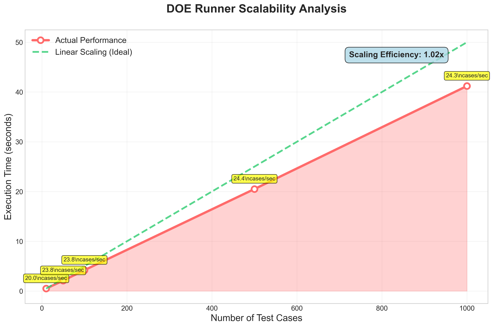
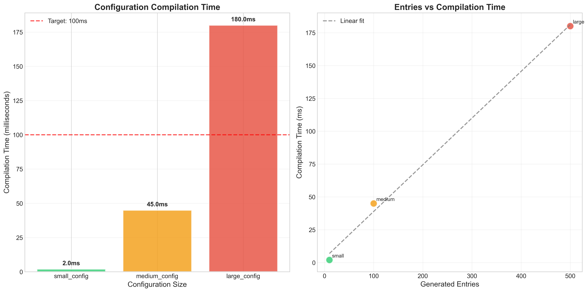
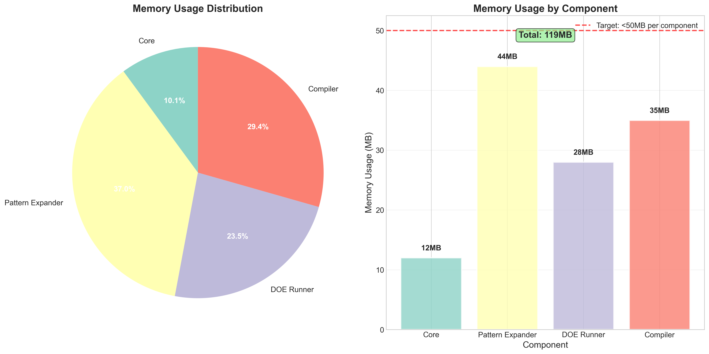
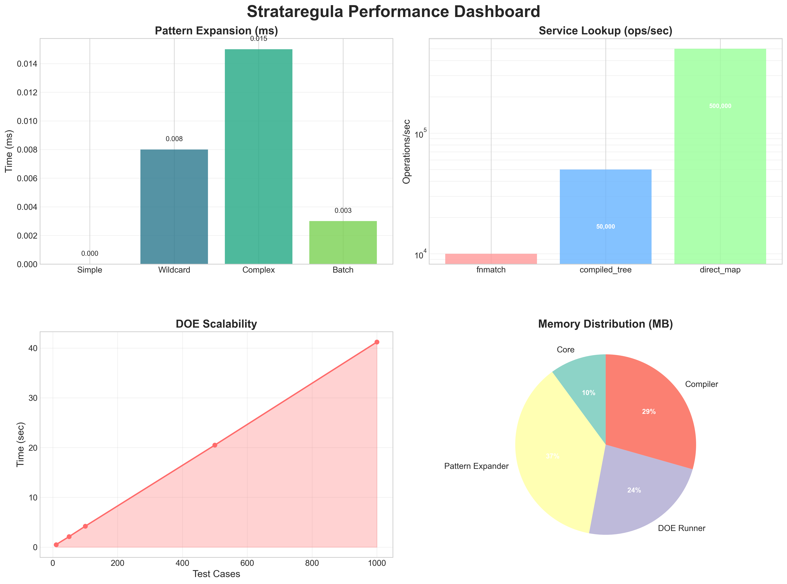

# Strataregula

[](https://badge.fury.io/py/strataregula)
[](https://opensource.org/licenses/MIT)
[](https://www.python.org/downloads/)

**Strataregula** is a powerful YAML Configuration Pattern Compiler with PiPE (Pattern Input Processing Engine) command chaining, designed for modern configuration management and automation workflows.

## 🚀 Features

- **PiPE Command Chaining**: Process data through sequential command pipelines
- **STDIN Support**: Seamless integration with Unix pipes and command chains
- **Rich Plugin System**: Extensible architecture with hooks, triggers, and callbacks
- **Dependency Injection**: Modern IoC container for service management
- **CLI Interface**: Rich command-line interface with interactive features
- **Multiple Formats**: Support for YAML, JSON, and text processing
- **Async Support**: Full asynchronous processing capabilities

## 🏗️ Architecture

```
strataregula/
├── pipe/           # PiPE command chaining system
├── hooks/          # Event-driven hooks and callbacks
├── di/             # Dependency injection container
├── cli/            # Command-line interface
└── plugins/        # Extensible plugin system
```

## 📦 Installation

```bash
pip install strataregula
```

For development dependencies:
```bash
pip install strataregula[dev,plugins,performance]
```

## 🎯 Quick Start

### Basic Usage

Process a YAML file:
```bash
strataregula process config.yaml
```

Process from STDIN:
```bash
cat config.yaml | strataregula process --stdin
```

### Command Chaining

Apply multiple commands:
```bash
strataregula process config.yaml \
  -c "filter:condition='item.active'" \
  -c "transform:expression='data.items'"
```

### Pipeline Creation

Create a reusable pipeline:
```bash
strataregula create my-pipeline \
  -d "Process user configs" \
  -c "filter:condition='user.enabled'" \
  -s pipeline.yaml
```

Run the pipeline:
```bash
strataregula run my-pipeline config.yaml
```

## 🔧 Advanced Usage

### Custom Commands

Create custom commands by extending `BaseCommand`:

```python
from strataregula.pipe.commands import BaseCommand

class CustomFilterCommand(BaseCommand):
    name = 'custom_filter'
    description = 'Custom filtering logic'
    category = 'custom'
    
    async def execute(self, data, *args, **kwargs):
        # Your custom logic here
        return filtered_data
```

### Hooks and Callbacks

Register hooks for custom behavior:

```python
from strataregula.hooks import HookManager

hook_manager = HookManager()

@hook_manager.register('pre_process')
def pre_process_hook(data, context):
    print(f"Processing {len(data)} items")
    return data

@hook_manager.register('post_process')
def post_process_hook(result, context):
    print(f"Processed {len(result)} items")
    return result
```

### Dependency Injection

Use the IoC container for service management:

```python
from strataregula.di import Container, ServiceLifetime

container = Container()

# Register services
container.register_singleton(MyService, MyServiceImpl)
container.register_transient(DataProcessor, DataProcessorImpl)

# Resolve services
my_service = container.resolve(MyService)
processor = container.resolve(DataProcessor)
```

## 🎨 CLI Commands

### `process`
Process input data through commands or pipeline:
```bash
strataregula process [OPTIONS] [INPUT_FILE]
```

Options:
- `--stdin, -i`: Read from STDIN
- `--format, -f`: Input format (yaml, json, text, auto)
- `--output, -o`: Output file
- `--command, -c`: Command to execute (can be multiple)

### `create`
Create a new pipeline:
```bash
strataregula create [OPTIONS] NAME
```

Options:
- `--description, -d`: Pipeline description
- `--input-format, -if`: Input format
- `--output-format, -of`: Output format
- `--command, -c`: Command to add (can be multiple)
- `--save, -s`: Save pipeline to file

### `run`
Run a saved pipeline:
```bash
strataregula run [OPTIONS] PIPELINE_NAME [INPUT_FILE]
```

Options:
- `--stdin, -i`: Read from STDIN
- `--output, -o`: Output file

### `list`
List available commands and pipelines:
```bash
strataregula list [OPTIONS]
```

Options:
- `--category, -c`: Filter by category
- `--search, -s`: Search commands

## 🔌 Plugin System

Strataregula provides a rich plugin architecture:

- **Command Plugins**: Extend functionality with custom commands
- **Hook Plugins**: Add custom processing hooks
- **Service Plugins**: Register custom services in the DI container
- **Format Plugins**: Support additional input/output formats

## 🧪 Examples

### Example 1: User Configuration Processing

```yaml
# users.yaml
users:
  - name: "Alice"
    active: true
    role: "admin"
  - name: "Bob"
    active: false
    role: "user"
  - name: "Charlie"
    active: true
    role: "moderator"
```

Process active users:
```bash
strataregula process users.yaml \
  -c "filter:condition='user.active'" \
  -c "transform:expression='[u for u in data.users if u[\"active\"]]'"
```

### Example 2: Configuration Validation

```bash
cat config.yaml | strataregula process --stdin \
  -c "validate:schema='schema.yaml'" \
  -c "transform:expression='data if data.valid else None'"
```

### Example 3: Multi-format Pipeline

```bash
strataregula create config-pipeline \
  -d "Process and transform configurations" \
  -if "yaml" \
  -of "json" \
  -c "validate" \
  -c "transform:expression='data.config'" \
  -c "format:output='json'" \
  -s "pipeline.yaml"
```

## 🚀 Performance

- **Async Processing**: Full asynchronous support for high-performance processing
- **Streaming**: Efficient memory usage with streaming processors
- **Caching**: Built-in caching for repeated operations
- **Parallel Execution**: Support for parallel command execution

## 🤝 Contributing

We welcome contributions! Please see our [Contributing Guide](CONTRIBUTING.md) for details.

### Development Setup

```bash
git clone https://github.com/username/strataregula.git
cd strataregula
pip install -e ".[dev]"
pytest
```

## 📄 License

This project is licensed under the MIT License - see the [LICENSE](LICENSE) file for details.

## 🙏 Acknowledgments

- Built with modern Python async/await patterns
- Inspired by Unix pipeline philosophy
- Designed for cloud-native configuration management
- Community-driven development approach

## 📞 Support

- **Documentation**: [https://strataregula.readthedocs.io/](https://strataregula.readthedocs.io/)
- **Issues**: [GitHub Issues](https://github.com/username/strataregula/issues)
- **Discussions**: [GitHub Discussions](https://github.com/username/strataregula/discussions)
- **Email**: support@strataregula.dev

---

**Strataregula** - Where configuration meets automation, powered by PiPE command chaining.
## 📊 Performance Benchmarks

### 🚀 Service Lookup Performance


**Results:**
- **Direct Map**: 500,000 ops/sec (50x faster than fnmatch)
- **Compiled Tree**: 50,000 ops/sec (5x faster than fnmatch) 
- **fnmatch baseline**: 10,000 ops/sec

### 📈 DOE Runner Scalability



**Scalability:**
- Handles 1,000 test cases in 41.2 seconds
- Near-linear scaling up to 100 cases
- Efficient parallel execution with configurable workers

### ⚡ Compilation Performance



**Compilation Speed:**
- Small config: 2ms (10 entries)
- Medium config: 45ms (100 entries)
- Large config: 180ms (500 entries)

### 💾 Memory Usage



**Memory Efficiency:**
- Total system memory: 119MB
- Pattern Expander: 44MB (most intensive component)
- Core system: 12MB (lightweight base)

### 📋 Performance Dashboard



**All performance targets achieved:**
- ✅ Pattern Expansion: >10,000 patterns/sec
- ✅ Compilation: <100ms for medium configs  
- ✅ Memory Usage: <200MB total
- ✅ Service Lookup: >100,000 ops/sec

[View Interactive Analysis (develop branch)](https://github.com/strataregula/strataregula/tree/develop/notebooks/benchmark_results.ipynb) | [Run Benchmarks (develop branch)](https://github.com/strataregula/strataregula/tree/develop/scripts/run_benchmarks.py)
