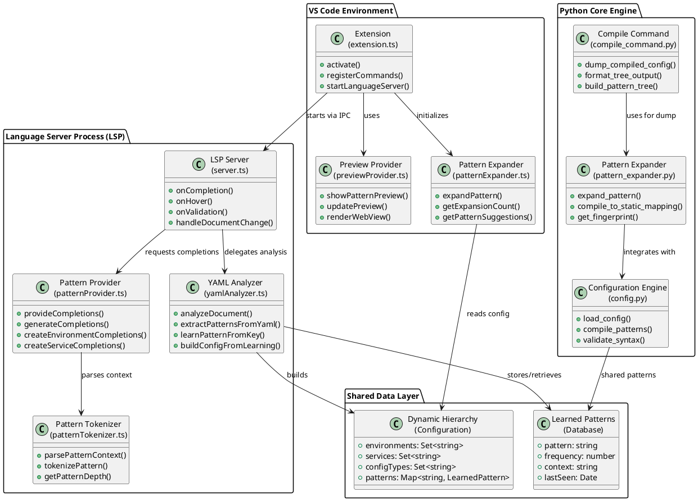
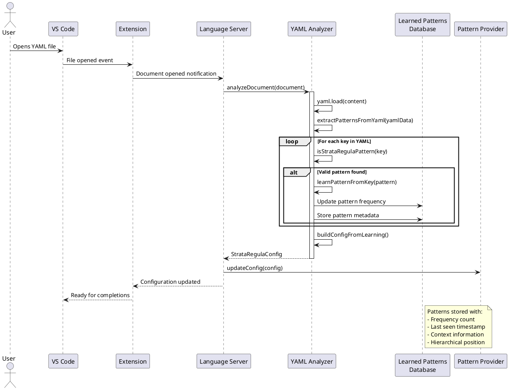
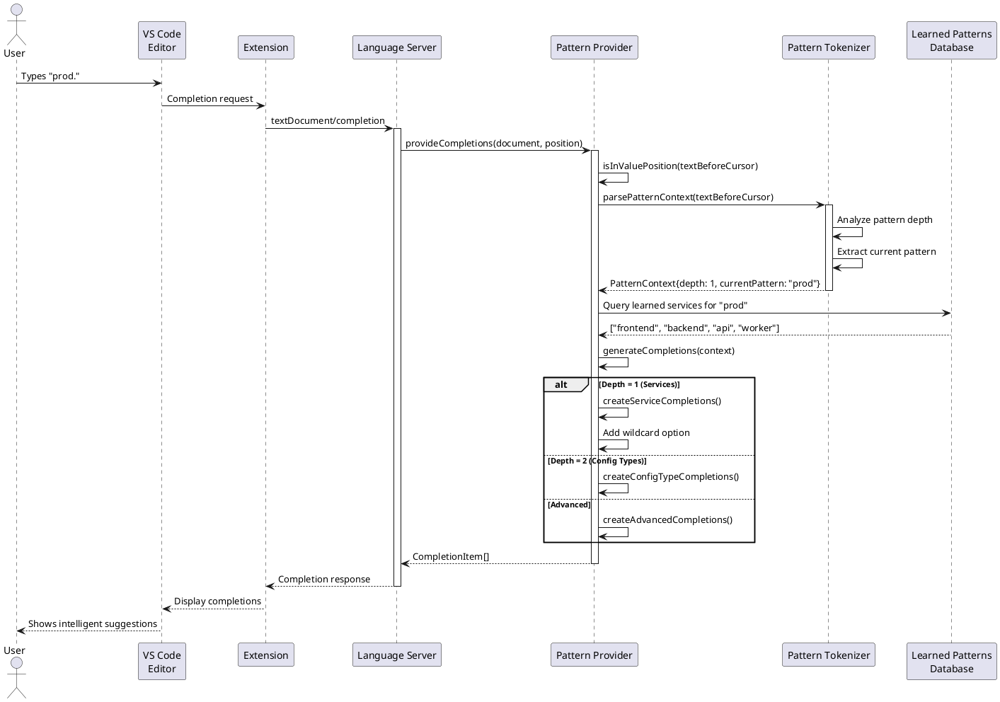
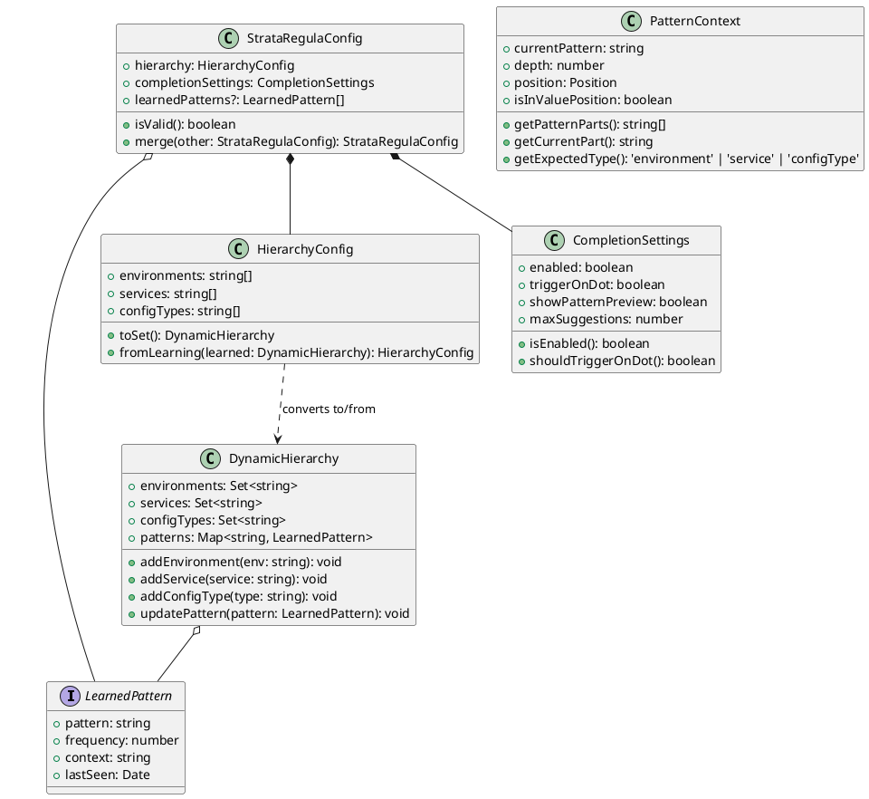
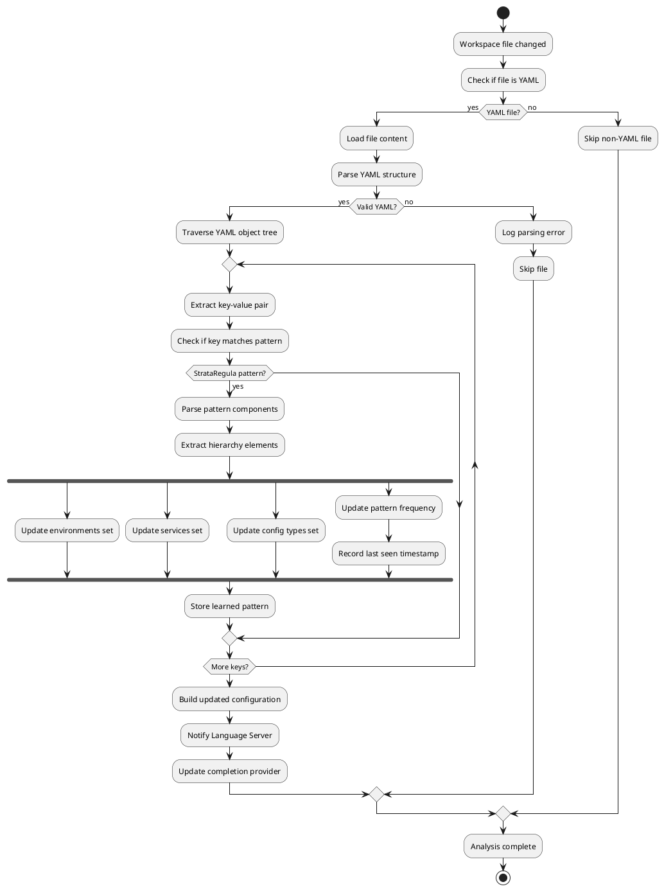
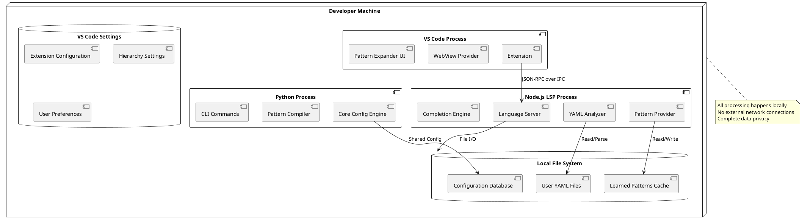
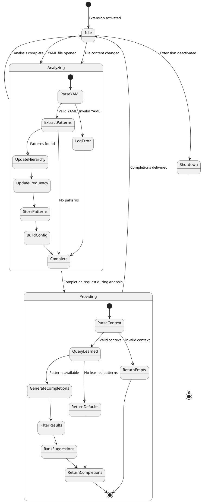
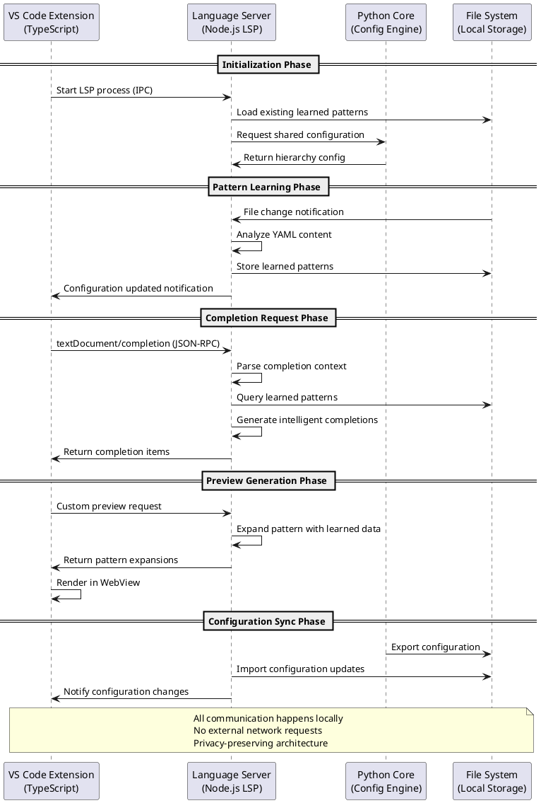

# StrataRegula System Architecture - UML Diagrams

## Component Diagram: Overall System Architecture



## Sequence Diagram: Dynamic Pattern Learning Flow



## Sequence Diagram: IntelliSense Completion Flow



## Class Diagram: Core Data Structures



## Activity Diagram: YAML File Analysis Process



## Deployment Diagram: System Distribution



## State Diagram: Pattern Learning States



## Communication Protocol Diagram



## Performance Analysis Diagram

```plantuml
@startuml Performance_Analysis

rectangle "Analysis Performance Metrics" {
    
    rectangle "YAML File Analysis" as analysis {
        - File size: 1KB - 10MB
        - Parse time: 5ms - 500ms
        - Pattern extraction: 1ms - 50ms
        - Memory usage: 100KB - 10MB
    }
    
    rectangle "Completion Response" as completion {
        - Context parsing: <1ms
        - Pattern lookup: <5ms
        - Result generation: <10ms
        - Total response: <16ms
    }
    
    rectangle "Memory Management" as memory {
        - Pattern cache: LRU with 1000 entries
        - File watching: Debounced 300ms
        - Garbage collection: Every 1000 patterns
        - Peak memory: <50MB
    }
    
    rectangle "Scalability Limits" as scale {
        - Max YAML files: 10,000
        - Max patterns: 100,000
        - Max completions: 50/request
        - Concurrent analysis: 5 files
    }
}

rectangle "Performance Optimizations" {
    
    rectangle "Incremental Processing" as incremental {
        + Only analyze changed content
        + Diff-based pattern updates
        + Lazy loading of completions
        + Progressive enhancement
    }
    
    rectangle "Caching Strategy" as caching {
        + Pattern frequency cache
        + Completion result cache
        + File content hash cache
        + Configuration state cache
    }
    
    rectangle "Async Processing" as async {
        + Non-blocking file analysis
        + Background pattern learning
        + Debounced file watching
        + Streaming completions
    }
}

analysis --> incremental : optimized by
completion --> caching : accelerated by
memory --> async : managed through

@enduml
```

## Security and Privacy Architecture

```plantuml
@startuml Security_Architecture

package "Privacy Boundaries" {
    
    rectangle "Local Processing Zone" {
        component [VS Code Extension]
        component [Language Server Process]
        component [Python Configuration Engine]
        database [Local File System]
        
        [VS Code Extension] --> [Language Server Process] : IPC (Local)
        [Language Server Process] --> [Python Configuration Engine] : File I/O (Local)
        [Language Server Process] --> [Local File System] : Read/Write (Local)
        
        note bottom : All processing happens within\nuser's local environment
    }
    
    rectangle "Network Boundary" {
        component [Internet] <<external>>
        component [Cloud Services] <<external>>
        component [External APIs] <<external>>
        
        note bottom : NO network connections\nfrom StrataRegula system
    }
}

rectangle "Data Protection Measures" {
    
    rectangle "Configuration Data" {
        - Stored locally only
        - No transmission outside machine
        - User-controlled retention
        - Automatic cleanup options
    }
    
    rectangle "Pattern Learning Data" {
        - Derived from user's own files
        - No external data sources
        - Configurable privacy settings
        - Opt-out mechanisms
    }
    
    rectangle "System Isolation" {
        - Sandboxed Language Server
        - No elevated privileges required
        - Read-only access to source files
        - Temporary data cleanup
    }
}

[Local Processing Zone] .up.> [Network Boundary] : NO CONNECTION
[Local Processing Zone] --> [Data Protection Measures] : implements

@enduml
```

This comprehensive UML documentation provides a complete technical view of the StrataRegula system architecture, covering all major components, interactions, data flows, and design decisions that support the dynamic YAML pattern learning innovation.

## System Extensibility Architecture

```plantuml
@startuml System_Extensibility

package "Core Extension Points" {
    
    interface "Plugin Interface" as PluginInterface {
        +initialize()
        +processPattern()
        +cleanup()
    }
    
    interface "Hook Interface" as HookInterface {
        +beforePatternAnalysis()
        +afterPatternAnalysis()
        +onPatternLearned()
    }
    
    interface "Extension Interface" as ExtensionInterface {
        +extendCompletions()
        +customizeValidation()
        +addCustomPatterns()
    }
}

package "Plugin System" {
    
    class "Base Plugin" as BasePlugin {
        +name: string
        +version: string
        +description: string
        
        +activate(): void
        +deactivate(): void
    }
    
    class "Pattern Plugin" as PatternPlugin {
        +patternTypes: Set<string>
        +customValidators: Map<string, Validator>
        
        +registerPatternType(type: string): void
        +addCustomValidator(pattern: string, validator: Validator): void
    }
    
    class "Hook Plugin" as HookPlugin {
        +hookPoints: Set<string>
        +callbacks: Map<string, Function>
        
        +registerHook(hookPoint: string, callback: Function): void
        +executeHook(hookPoint: string, data: any): any
    }
}

package "Extension Registry" {
    
    class "Plugin Registry" as PluginRegistry {
        +plugins: Map<string, BasePlugin>
        +activePlugins: Set<string>
        
        +registerPlugin(plugin: BasePlugin): void
        +activatePlugin(name: string): void
        +deactivatePlugin(name: string): void
        +getPlugin(name: string): BasePlugin?
    }
    
    class "Hook Registry" as HookRegistry {
        +hooks: Map<string, HookPlugin[]>
        
        +registerHook(hookPoint: string, plugin: HookPlugin): void
        +executeHooks(hookPoint: string, data: any): any[]
    }
}

package "Extension Lifecycle" {
    
    state "Extension Loading" as Loading {
        [*] --> ValidatePlugin
        ValidatePlugin --> LoadDependencies
        LoadDependencies --> InitializePlugin
        InitializePlugin --> RegisterInterfaces
        RegisterInterfaces --> [*]
    }
    
    state "Extension Execution" as Execution {
        [*] --> HookExecution
        HookExecution --> PatternProcessing
        PatternProcessing --> CustomValidation
        CustomValidation --> [*]
    }
    
    state "Extension Cleanup" as Cleanup {
        [*] --> SaveState
        SaveState --> UnregisterInterfaces
        UnregisterInterfaces --> ReleaseResources
        ReleaseResources --> [*]
    }
}

' Relationships
BasePlugin ..|> PluginInterface
PatternPlugin --|> BasePlugin
HookPlugin --|> BasePlugin

PluginRegistry --> BasePlugin : manages
HookRegistry --> HookPlugin : manages

PluginInterface --> ExtensionRegistry : registers with
HookInterface --> HookRegistry : registers with

Loading --> Execution : transitions to
Execution --> Cleanup : transitions to

@enduml
```