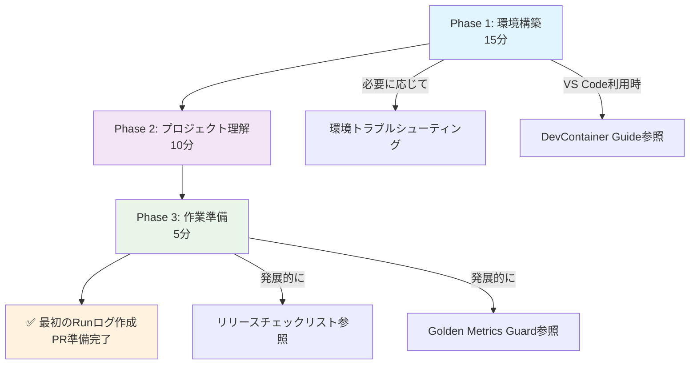

# 新規参加者向けオンボーディング 🚀

**目標**: 30分で開発環境を構築し、60分以内に最初のコントリビューションができる状態になること。

---

## ⚠️ 推奨環境

**最適な体験のため**: 新しい仮想環境（venv）またはコンテナ環境での実行を強く推奨します。既存の開発環境では依存関係の競合やキャッシュ問題が発生する可能性があります。

## 📋 必読文書（所要時間付き）

### Phase 1: 環境構築（15分）
1. **[環境セットアップ](environment/SETUP.md)** ⭐⭐⭐ (10分)
   - Python 3.11 + venv + 依存関係インストール
   - `pytest -q` による動作確認
2. **[トラブルシューティング](environment/TROUBLESHOOTING.md)** (必要時参照)
   - 環境構築で問題が発生した場合のみ確認

### Phase 2: プロジェクト理解（10分）
3. **[README.md](../README.md)** ⭐⭐ (5分)
   - プロジェクト概要と "Speed Without Surprises" 哲学
   - 最小限の実行例
4. **[開発ルール](../.development-rules.md)** ⭐⭐⭐ (5分)
   - バージョニング規則
   - PR 作成ルールと必須更新ファイル

### Phase 3: 作業準備（5分）
5. **[CONTRIBUTING.md](../CONTRIBUTING.md)** ⭐⭐ (5分)
   - 開発ワークフロー
   - コードスタイルと Runログ作成要件

---

## 🎯 初回作業チェックリスト

- [ ] 環境構築完了（`pytest -q` が成功）
- [ ] 開発ルールを理解（PR 基準と Runログ要件）
- [ ] 最初の Runログを作成し、`docs/run/` に保存

---

## 📖 参考文書（作業中に参照）

- **[リリースチェックリスト](RELEASE_CHECKLIST.md)** - リリース担当者向け
- **[Golden Metrics Guard](GOLDEN_METRICS_GUARD.md)** - パフォーマンス要件
- **[DevContainer Guide](environment/DEVCONTAINER.md)** - VS Code 環境統一ガイド

---

## 🚀 次のステップ

1. 上記チェックリストをクリア  
2. 最初の簡単な Issue にアサインされ、PR を作成  
3. CI を通過し、Runログが残せれば最初のコントリビューション完了！

---

## 🗺️ Onboarding Flow (Visual Guide)

