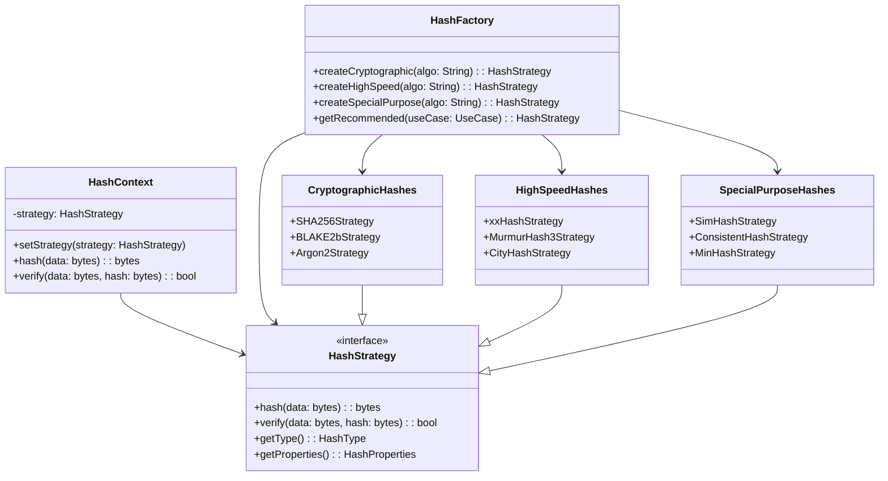
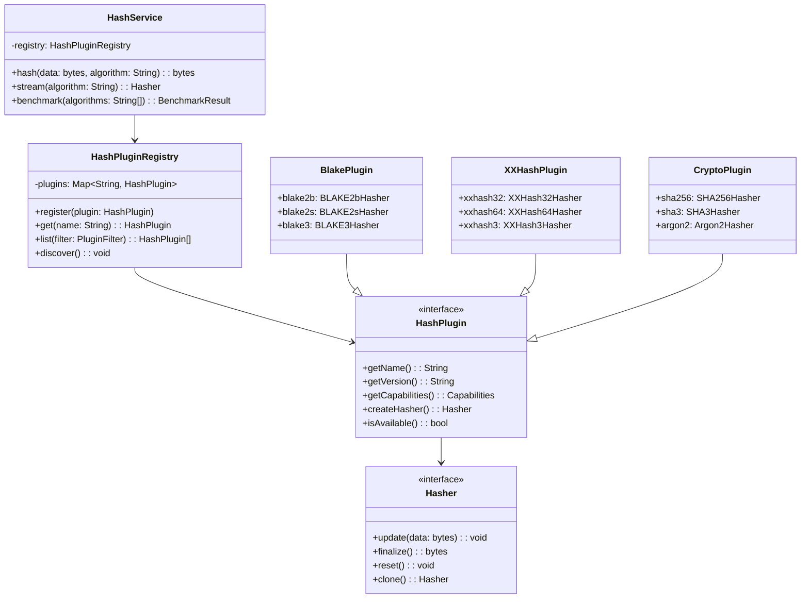
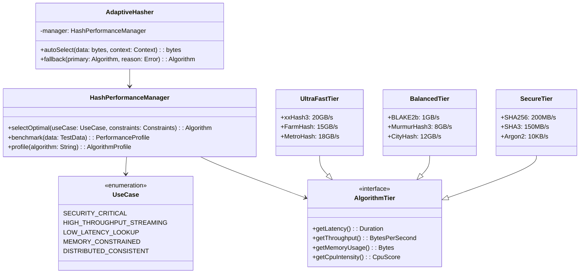
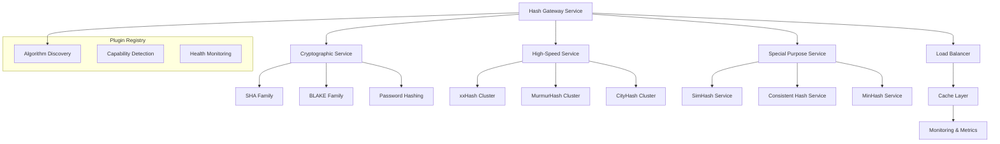

# Hash Algorithm Packaging Architecture Patterns

## 📋 概要

ハッシュアルゴリズムの多様性と用途特性を考慮した、効率的なパッケージ化アーキテクチャパターンの設計と実装指針。

## 🎯 設計要件

### 機能要件
- 30+ 主要アルゴリズムのサポート（暗号学的・高速・特殊用途）
- 動的アルゴリズム選択とロード
- パフォーマンス最適化（用途別）
- 拡張性（新アルゴリズム追加）

### 非機能要件
- **高速性**: 非暗号学的ハッシュは超高速動作
- **安全性**: 暗号学的ハッシュは安全性保証
- **スケーラビリティ**: プラグイン型拡張
- **保守性**: 分離された実装と明確なインターface

## 🏗️ アーキテクチャパターン

### Pattern 1: Strategy + Factory (用途別分類)



**優点**:
- 用途別明確分離
- Factory経由の統一インターface
- アルゴリズム特性の型安全性

**欠点**:
- 新カテゴリ追加時のFactory修正必要
- カテゴリ跨ぎのアルゴリズム分類困難

### Pattern 2: Plugin Registry Architecture (拡張性重視)



**優点**:
- 高い拡張性（プラグイン追加容易）
- 動的ロード・アンロード可能
- 第三者実装サポート

**欠点**:
- 実行時エラーリスク増加
- 初期化オーバーヘッド

### Pattern 3: Performance-Driven Hierarchy (性能最適化)



**優点**:
- 性能要件に基づく自動選択
- ベンチマーク駆動最適化
- アダプティブ動作

**欠点**:
- 複雑な性能プロファイリング必要
- 環境依存性高い

### Pattern 4: Microservice Architecture (分散・拡張性)



**優点**:
- 独立スケーリング可能
- 障害分離
- 技術スタック多様化

**欠点**:
- ネットワークオーバーヘッド
- 運用複雑性増加

## 🎪 実装指針

### 推奨パターン選択

| 用途 | 推奨パターン | 理由 |
|------|-------------|------|
| **ライブラリ** | Strategy + Factory | 静的型安全性、シンプル |
| **アプリケーション** | Plugin Registry | 拡張性、動的ロード |
| **高性能システム** | Performance-Driven | 最適化、アダプティブ |
| **分散システム** | Microservice | スケーラビリティ、独立性 |

### パッケージ構造例

```
hash-algorithms/
├── core/                   # 共通interface・基盤
│   ├── hasher.py          # Hasher interface
│   ├── strategy.py        # Strategy pattern基盤
│   └── registry.py        # Plugin registry
├── cryptographic/         # 暗号学的ハッシュ
│   ├── sha/               # SHA family
│   ├── blake/             # BLAKE family
│   └── password/          # Argon2, bcrypt
├── highspeed/             # 高速ハッシュ
│   ├── xxhash/           # xxHash variants
│   ├── murmur/           # MurmurHash family
│   └── city/             # CityHash, FarmHash
├── special/               # 特殊用途
│   ├── similarity/       # SimHash, MinHash
│   ├── consistent/       # Consistent hashing
│   └── checksum/         # CRC variants
├── adapters/              # 外部ライブラリadapter
├── benchmarks/            # 性能測定ツール
└── plugins/               # 拡張プラグイン
```

### パフォーマンス指標

```python
class HashBenchmarkSuite:
    """ハッシュアルゴリズム性能測定スイート"""
    
    BENCHMARK_CASES = {
        'small': 64,        # 64 bytes
        'medium': 1024,     # 1 KB  
        'large': 1024*1024, # 1 MB
        'huge': 100*1024*1024  # 100 MB
    }
    
    METRICS = [
        'throughput_mb_per_sec',
        'latency_nanoseconds', 
        'memory_peak_bytes',
        'cpu_cycles_per_byte'
    ]
```

## 📊 推奨実装戦略

### Phase 1: Core Foundation
- Strategy + Factory pattern実装
- 主要アルゴリズム（BLAKE2b, xxHash, SHA256）
- 基本性能測定

### Phase 2: Plugin Ecosystem
- Plugin Registry拡張
- 動的ロード機能
- 第三者プラグインサポート

### Phase 3: Performance Optimization
- アダプティブ選択機能
- 環境特化最適化
- 分散処理対応

---

**作成者**: Claude Code  
**作成日**: 2025-08-28  
**対象**: StrataRegula Ecosystem Hash Algorithm Integration