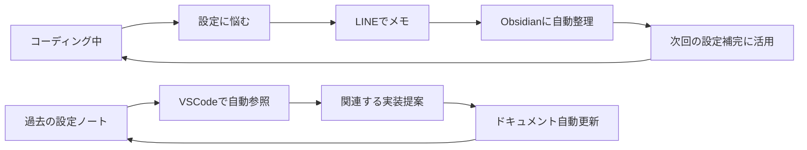

# Strataregula Technology Ecosystem Vision
## 相乗効果を生む技術プラットフォーム戦略

### Executive Summary

Strataregula は単独のプロダクトを超えて、**相互に強化し合う技術エコシステム**として発展する可能性を持っています。設定管理のインテリジェンスで培った技術を、ナレッジマネジメントや開発ワークフロー統合に拡張することで、開発者体験の根本的な改善を実現します。

---

## 🔄 Core Technology Synergy Loop

### Strataregula → LINE/Obsidian Bridge
**提供する技術資産**
```yaml
構造解析エンジン:
  - YAML/JSON/Markdown パーサー技術
  - 階層構造の自動認識アルゴリズム
  - パターン学習・推論システム

コンテキスト理解:
  - 文脈に基づく分類ロジック
  - 意図推定アルゴリズム
  - 関連性スコアリング

インテリジェント補完:
  - 予測エンジンのコア技術
  - リアルタイム学習システム
  - ユーザー行動分析

プライバシー保護アーキテクチャ:
  - ローカル処理設計思想
  - セキュアなデータハンドリング
  - 暗号化・匿名化技術
```

### LINE/Obsidian Bridge → Strataregula
**フィードバックループによる進化**
```yaml
自然言語処理の向上:
  - 多様なメッセージパターンからの学習
  - 文脈理解精度の向上
  - 意図認識アルゴリズムの refinement

複雑な構造パターン学習:
  - Obsidian のネットワーク構造分析
  - より高度な関連性パターンの発見
  - 多次元データの構造化技術

ユーザー行動インサイト:
  - 実際の使用パターンから設定推奨の改善
  - エラーパターンの事前予測
  - 個人化アルゴリズムの精緻化

エッジケース発見:
  - 予期しない使用方法の発見
  - システムの堅牢性向上
  - 新機能アイデアの創出
```

---

## 💡 Product Evolution Phases

### Phase 1: Foundation Building (3-6ヶ月)
**Strataregula Core の完成**
```
VSCode Extension:
✅ 基本的なパターン学習
✅ インテリジェント補完
✅ リアルタイム検証
⭐ ユーザーベース構築 (1,000+ downloads)

技術資産の蓄積:
✅ パターン認識エンジン
✅ 構造解析ライブラリ
✅ プライバシー保護アーキテクチャ
✅ ローカル学習システム
```

**成果物・学習データ**
- 設定ファイルの構造パターン理解
- 開発者の意図推定技術
- エラーパターンの分類ノウハウ
- ユーザビリティ最適化知見

### Phase 2: Cross-Platform Intelligence (6-12ヶ月)
**LINE/Obsidian Bridge 開発**
```
LINE Bot/App:
🚀 メッセージの自動分類
🚀 コンテキスト理解（Strataregula 技術活用）
🚀 プロジェクト・カテゴリ自動推定
🚀 優先度・緊急度の判定

Obsidian Integration:
🚀 自動フォルダ構造生成
🚀 関連ノートの自動リンク
🚀 タグ・メタデータ自動付与
🚀 検索・発見性の向上
```

**技術的相乗効果**
- Strataregula の構造解析 → メッセージの階層化
- 設定パターン学習 → ノート構造最適化
- 補完技術 → 自動タグ提案
- 文脈理解 → 関連性判定

### Phase 3: Integrated Development Experience (12-24ヶ月)
**双方向インテリジェンス**


**統合機能例**
```yaml
実装→ドキュメント自動同期:
  trigger: "設定変更をコミット"
  action: "関連するObsidianノートを更新提案"
  
文脈継続支援:
  trigger: "昨日の作業メモを参照"
  action: "関連する設定・コードを VSCode で自動表示"
  
プロジェクト横断学習:
  trigger: "新しいプロジェクト開始"
  action: "過去の類似プロジェクトパターンを提案"
```

### Phase 4: Ecosystem Platform (24+ ヶ月)
**技術プラットフォーム化**
```
Developer API:
📡 パターン学習エンジン API
📡 構造解析サービス
📡 コンテキスト理解 API
📡 自動分類・推論システム

Third-party Integrations:
🔌 Slack/Discord → 自動議事録整理
🔌 GitHub/GitLab → コミット→ドキュメント連携
🔌 Notion/Confluence → 技術文書自動構造化
🔌 JIRA/Linear → 課題→実装パターン学習
```

---

## 🎯 Strategic Development Roadmap

### 開発優先順位の戦略的考慮

#### Option A: Sequential Development (推奨)
```
Month 1-6:  Strataregula VSCode 完成・ユーザー獲得
Month 7-12: 技術ノウハウを活用して LINE Bridge 開発
Month 13-18: Obsidian 連携完成・エコシステム構築
Month 19-24: API化・プラットフォーム展開
```

**利点:**
- 各フェーズでの学習を次に活かせる
- ユーザーフィードバックを段階的に取得
- 技術的負債を最小化
- 収益化タイミングを最適化

#### Option B: Parallel Development
```
同時進行で両プロダクト開発
```
**リスク:**
- 技術負債の累積
- 品質管理の困難
- リソース分散による中途半端な結果

### 技術共通基盤の設計

**Shared Core Library**
```typescript
@strataregula/core
├── pattern-recognition/    # パターン認識エンジン
├── structure-analysis/     # 構造解析ライブラリ  
├── context-understanding/  # 文脈理解システム
├── learning-engine/        # 機械学習・推論
├── privacy-protection/     # プライバシー保護
└── user-interface/         # 共通UI コンポーネント
```

**各プロダクトでの活用**
```yaml
Strataregula VSCode:
  - pattern-recognition → 設定パターン学習
  - structure-analysis → YAML/JSON解析
  - learning-engine → 補完予測

LINE/Obsidian Bridge:
  - pattern-recognition → メッセージ分類
  - context-understanding → 意図理解
  - structure-analysis → ノート構造最適化
```

---

## 🔬 Technical Innovation Opportunities

### AI/ML 技術の先端応用

**1. Multi-Modal Pattern Learning**
```
Configuration Patterns + Natural Language → Enhanced Understanding
設定ファイル + 開発者メッセージ → より深い意図理解
```

**2. Temporal Context Intelligence**
```
時系列データ + 作業パターン → 予測的支援
"いつものこの時間は〇〇の設定をいじる" → 事前準備
```

**3. Cross-Project Pattern Transfer**
```
類似プロジェクト間でのパターン転移学習
新規プロジェクト → 既存パターンの適応提案
```

### プライバシー技術の革新

**Federated Learning for Configuration**
```
個人データを外部送信せずに
→ 集合知としてのパターン学習
→ 全ユーザーの体験向上
```

**Differential Privacy in Pattern Sharing**
```
個人の設定パターンを匿名化
→ 統計的有用性は保持
→ プライバシー保護と利便性の両立
```

---

## 💰 Business Model Evolution

### Phase 1: Developer Tool (Strataregula)
```yaml
Revenue Model:
  - Freemium VSCode Extension
  - Pro features: $5/month per developer
  - Enterprise: $50/developer/month
  
Target Market:
  - Individual developers: 10K users
  - Small teams: 1K teams  
  - Enterprise: 100 companies
```

### Phase 2: Integrated Productivity Suite
```yaml
Revenue Model:
  - Personal: $10/month (LINE + Obsidian + VSCode)
  - Professional: $25/month (API access, advanced features)
  - Enterprise: $100/developer/month (full platform)

Value Proposition:
  - 開発・ドキュメント・コミュニケーションの統合
  - 組織のナレッジベース自動構築
  - 開発生産性の飛躍的向上
```

### Phase 3: Platform Business
```yaml
Revenue Streams:
  - API usage fees: $0.01/request
  - Integration marketplace: 30% commission
  - Custom enterprise solutions: $100K+ contracts
  - Training/consulting services: $1K/day

Market Expansion:
  - Developer tools市場: $25B
  - Knowledge management市場: $15B  
  - Business process automation: $19B
```

---

## 🎨 User Experience Vision

### Seamless Workflow Integration

**Morning Routine Example:**
```
07:00 - LINE: "昨日のバグ修正、設定ミスが原因だった"
      → Obsidianに自動分類: Projects/BugFixes/Configuration/
      
09:00 - VSCode起動: 自動的に昨日の作業文脈を復元
      → 関連する設定ファイルをハイライト
      → "類似バグの予防策"を提案表示
      
10:00 - 新しい設定追加時: 過去の経験から最適値を提案
      → "このパターンは過去3回エラーになっています"
```

**Project Handoff Scenario:**
```
チームメンバーA → チームメンバーB への引き継ぎ

A: LINE で "〇〇プロジェクトの設定周りの注意点メモ"
   → Obsidian で自動的にプロジェクト知識ベース更新

B: 新規参加時、VSCode で同プロジェクト開始
   → 自動的にAさんの知見・注意点が設定候補として表示
   → チーム全体の知識が個人の開発体験に反映
```

---

## 🚀 Innovation Differentiators

### vs. 既存ソリューション

**GitHub Copilot との差別化:**
- **Copilot**: 汎用コード生成
- **Strataregula Ecosystem**: 設定・ドキュメント・ワークフロー特化

**Notion/Obsidian との差別化:**
- **既存**: 手動でのナレッジ構築
- **Bridge**: 自動分類・構造化・開発ツール連携

**企業向けナレッジマネジメントとの差別化:**
- **既存**: 大規模・複雑・導入コスト高
- **Ecosystem**: 個人→チーム→組織の段階的成長

### 技術的独自性

1. **Configuration-Centric Intelligence**
   - 設定管理に特化した AI システム
   - 開発者の意図理解に最適化

2. **Privacy-First Cross-Platform Learning**
   - プライバシー保護しながらの知識共有
   - ローカル処理 + 連合学習

3. **Context-Aware Workflow Integration**
   - 開発作業の時系列文脈理解
   - ツール横断でのインテリジェント支援

---

## 📋 Next Action Items

### 技術実証 (Proof of Concept)
1. **Strataregula Core の MVP完成**
   - 基本パターン学習機能
   - 10-20名のベータテスター募集

2. **技術基盤共通化の検証**
   - Core library のアーキテクチャ設計
   - LINE Bot での簡易実装テスト

3. **ユーザーフィードバック収集**
   - 開発者の実際のペインポイント調査
   - 既存ツールとの差別化ポイント検証

### ビジネス検証
1. **市場調査の深化**
   - 競合分析の詳細化
   - 価格設定の妥当性検証

2. **パートナーシップ探索**
   - Microsoft (VSCode), Meta (Obsidian) との連携可能性
   - Enterprise 顧客の事前ヒアリング

### 技術開発
1. **Strataregula VSCode Extension の完成度向上**
   - パフォーマンス最適化
   - エラーハンドリング強化

2. **Core Library の基盤設計**
   - モジュール分割・API設計
   - 将来の拡張性を考慮した設計

---

## 🎯 Success Metrics

### Phase 1 Goals (6ヶ月)
- **Strataregula VSCode Extension**: 1,000+ active users
- **GitHub Stars**: 500+ stars
- **User Satisfaction**: 4.0+ rating
- **Technical Debt**: Maintainability Index > 80

### Phase 2 Goals (12ヶ月) 
- **LINE Bot**: 500+ daily active users
- **Obsidian Integration**: 100+ power users
- **Cross-platform Usage**: 50+ users using both tools
- **Revenue**: $5K+ MRR

### Phase 3 Goals (24ヶ月)
- **Platform API**: 10+ third-party integrations
- **Enterprise Customers**: 5+ paying enterprises  
- **Developer Community**: 5,000+ registered developers
- **Revenue**: $50K+ MRR

---

## 結論: Ecosystem としての競争優位性

この戦略の核心は、**個別のツールの優秀さではなく、ツール間の相乗効果**にあります。

- Strataregula 単体でも価値がある
- LINE Bridge 単体でも価値がある  
- **しかし組み合わせることで指数関数的な価値を生む**

これは単なる機能追加ではなく、**開発体験の根本的な再定義**を目指すものです。設定ファイルを書く時に過去の自分の知見が自動的に活用され、何気ないメッセージが将来の開発効率向上に繋がる——そんな未来を実現する技術エコシステムです。

**次のステップ**: Strataregula Core の完成度を高めながら、技術基盤の共通化設計を並行して進める。ユーザーからのフィードバックを通じて、エコシステム全体のビジョンを検証・洗練していく。