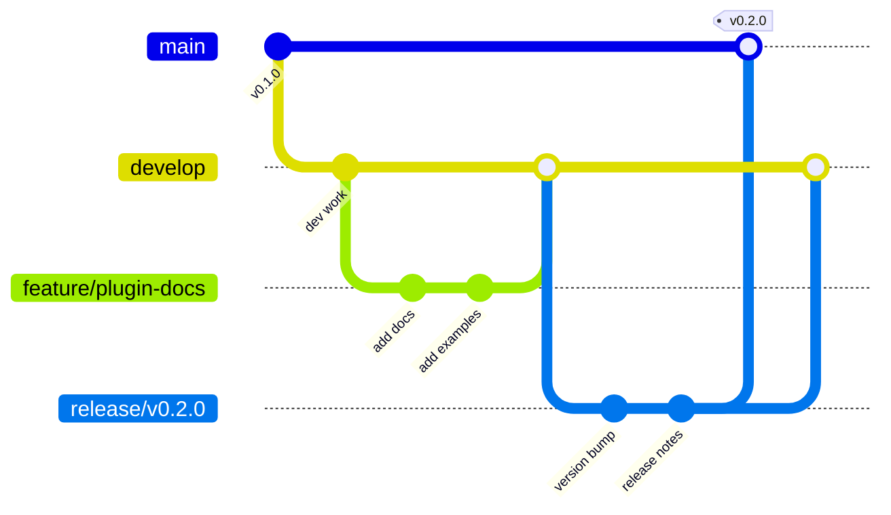

# Git Workflow and Branching Strategy

## 🌳 Branch Structure



## 📋 Branch Types and Naming Conventions

### 1. **Main Branches**

| Branch | Purpose | Protected | Direct Push |
|--------|---------|-----------|-------------|
| `master` (or `main`) | Production releases | Yes | No |
| `develop` | Development integration | Yes | No |

### 2. **Supporting Branches**

| Type | Naming Pattern | Created From | Merged To | Example |
|------|---------------|--------------|-----------|---------|
| **Feature** | `feature/<description>` | `develop` | `develop` | `feature/plugin-system` |
| **Release** | `release/v<version>` | `develop` | `master` & `develop` | `release/v0.2.0` |
| **Hotfix** | `hotfix/<description>` | `master` | `master` & `develop` | `hotfix/critical-bug` |
| **Bugfix** | `bugfix/<description>` | `develop` | `develop` | `bugfix/memory-leak` |

## 🔄 Standard Workflows

### A. Feature Development Workflow

```bash
# 1. Create feature branch from develop
git checkout develop
git pull origin develop
git checkout -b feature/my-new-feature

# 2. Work on feature
git add .
git commit -m "feat: add new feature"

# 3. Keep branch updated with develop
git checkout develop
git pull origin develop
git checkout feature/my-new-feature
git merge develop

# 4. Push feature branch
git push origin feature/my-new-feature

# 5. Create Pull Request to develop
# Review → Approve → Merge
```

### B. Release Workflow

```bash
# 1. Create release branch from develop
git checkout develop
git pull origin develop
git checkout -b release/v0.2.0

# 2. Prepare release
# - Update version numbers
# - Update CHANGELOG.md
# - Final bug fixes only
git add .
git commit -m "chore: prepare v0.2.0 release"

# 3. Push release branch
git push origin release/v0.2.0

# 4. After testing, merge to master
git checkout master
git pull origin master
git merge --no-ff release/v0.2.0
git tag -a v0.2.0 -m "Release version 0.2.0"
git push origin master --tags

# 5. Back-merge to develop
git checkout develop
git pull origin develop
git merge --no-ff release/v0.2.0
git push origin develop

# 6. Delete release branch
git branch -d release/v0.2.0
git push origin --delete release/v0.2.0
```

### C. Hotfix Workflow

```bash
# 1. Create hotfix from master
git checkout master
git pull origin master
git checkout -b hotfix/critical-bug

# 2. Fix the issue
git add .
git commit -m "fix: resolve critical bug"

# 3. Merge to master
git checkout master
git merge --no-ff hotfix/critical-bug
git tag -a v0.1.2 -m "Hotfix version 0.1.2"
git push origin master --tags

# 4. Merge to develop
git checkout develop
git merge --no-ff hotfix/critical-bug
git push origin develop

# 5. Delete hotfix branch
git branch -d hotfix/critical-bug
```

## 📐 Merge Rules

### 1. **Feature → Develop**
- Via Pull Request only
- Requires code review
- Must pass CI/CD checks
- Squash and merge recommended

### 2. **Develop → Release**
- Direct merge allowed
- No new features after branch creation
- Bug fixes only

### 3. **Release → Master**
- Via Pull Request
- Requires approval from maintainer
- Must pass all tests
- Create tag after merge

### 4. **Release → Develop (Back-merge)**
- Direct merge required
- Ensures develop has release changes
- Do immediately after master merge

## ✅ Commit Message Convention

Follow [Conventional Commits](https://www.conventionalcommits.org/):

```
<type>(<scope>): <subject>

<body>

<footer>
```

### Types:
- `feat`: New feature
- `fix`: Bug fix
- `docs`: Documentation only
- `style`: Code style changes
- `refactor`: Code refactoring
- `test`: Test additions/changes
- `chore`: Build process or auxiliary tool changes

### Examples:
```bash
feat(plugin): add hook system support
fix(compiler): resolve memory leak in pattern expansion
docs(readme): update installation instructions
chore: bump version to 0.2.0
```

## 🏷️ Version Tagging

### Tag Format:
- Release: `v<major>.<minor>.<patch>` (e.g., `v0.2.0`)
- Pre-release: `v<version>-<prerelease>` (e.g., `v0.2.0-beta.1`)

### Creating Tags:
```bash
# Annotated tag (recommended)
git tag -a v0.2.0 -m "Release version 0.2.0"

# Lightweight tag
git tag v0.2.0

# Push tags
git push origin --tags
```

## 🚀 Release Checklist

- [ ] All features merged to develop
- [ ] Create release branch from develop
- [ ] Update version in `__init__.py` and `pyproject.toml`
- [ ] Update CHANGELOG.md
- [ ] Run full test suite
- [ ] Build and test packages
- [ ] Create PR to master
- [ ] After merge, create GitHub Release
- [ ] Back-merge to develop
- [ ] Update PyPI if applicable

## 📊 Branch Protection Rules

### Master Branch:
- Require pull request reviews (1+)
- Dismiss stale reviews
- Require status checks (CI/CD)
- Require branches to be up to date
- Include administrators
- Restrict who can push

### Develop Branch:
- Require pull request reviews (1+)
- Require status checks (CI/CD)
- No direct push except from release branches

## 🔍 Common Scenarios

### Scenario 1: Adding Plugin Documentation
```bash
git checkout develop
git checkout -b feature/plugin-docs
# Work on documentation
git add docs/
git commit -m "docs(plugin): add plugin development guide"
git push origin feature/plugin-docs
# Create PR to develop
```

### Scenario 2: Preparing v0.2.0 Release
```bash
git checkout develop
git checkout -b release/v0.2.0
# Update versions and changelog
git add .
git commit -m "chore: prepare v0.2.0 release"
# Test thoroughly
# Merge to master and develop
```

### Scenario 3: Emergency Fix in Production
```bash
git checkout master
git checkout -b hotfix/api-error
# Fix the issue
git add .
git commit -m "fix: resolve API connection error"
# Merge to both master and develop
```

## 📝 Notes

1. **Never commit directly to master or develop** (except for back-merges)
2. **Delete feature branches after merge** to keep repository clean
3. **Keep commits atomic** - one logical change per commit
4. **Write meaningful commit messages** for better history
5. **Regularly sync feature branches** with develop to avoid conflicts

## 🔗 Tools and Automation

### GitHub Actions for Automation:
```yaml
# .github/workflows/release.yml
name: Release
on:
  push:
    branches: [master]
    tags: ['v*']
jobs:
  release:
    runs-on: ubuntu-latest
    steps:
      - uses: actions/checkout@v2
      - name: Create Release
        if: startsWith(github.ref, 'refs/tags/')
        uses: actions/create-release@v1
```

### Pre-commit Hooks:
```yaml
# .pre-commit-config.yaml
repos:
  - repo: https://github.com/pre-commit/pre-commit-hooks
    hooks:
      - id: trailing-whitespace
      - id: end-of-file-fixer
      - id: check-merge-conflict
```

---

**Last Updated**: 2025-08-26
**Version**: 1.0.0